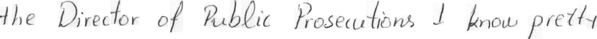
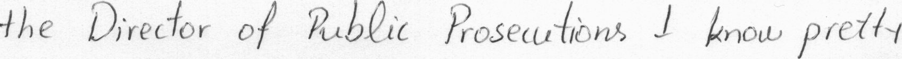
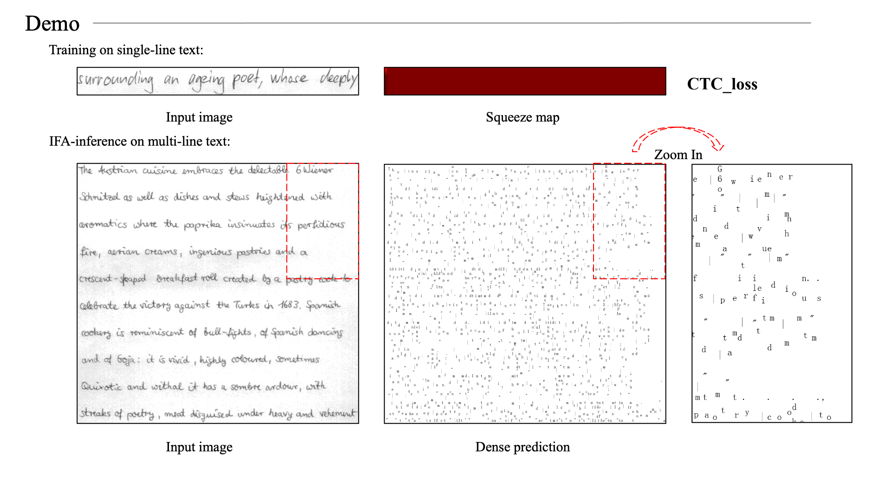

# Implicit Feature Alignment: Learn to Convert Text Recognizer to Text Spotter

This is a pytorch-based implementation for paper [Implicit Feature Alignment: Learn to Convert Text Recognizer to Text Spotter](https://arxiv.org/abs/2106.05920).

Due to the company's code confidentiality requirements, we only release the code of ExCTC on the IAM dataset.

Personally, I dont't think it is a thorough work, but I hope this idea is useful.

## Requirements

- [Python3](https://www.python.org/)
- [PyTorch1.6](https://pytorch.org/)
- [TorchVision](https://pypi.org/project/torchvision/)
- [OpenCV](https://opencv.org/)
- [PIL (Pillow)](https://pillow.readthedocs.io/en/stable/#)
- [edit_distance](https://pypi.org/project/edit_distance/)
- [Numpy](https://pypi.org/project/numpy/)

## Data Preparation
We re-crop the lines from IAM full-page images. This operation is to remove the edge phenomenon in the official line images.

Official image:



Re-cropped image:



These re-cropped images are used as training set.

## Training

Crop the training images (`data/crop_images.py`) and modify the path in configuration files (`cfgs.py`). Then

```bash
	python main.py
```

A simple demo:



## Ackowledgement

We use the [augmentation toolkit](https://github.com/RubanSeven/Text-Image-Augmentation-python) released by [RubanSeven](https://github.com/RubanSeven) to train the network.
